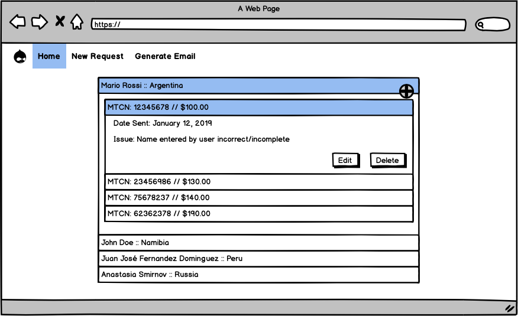
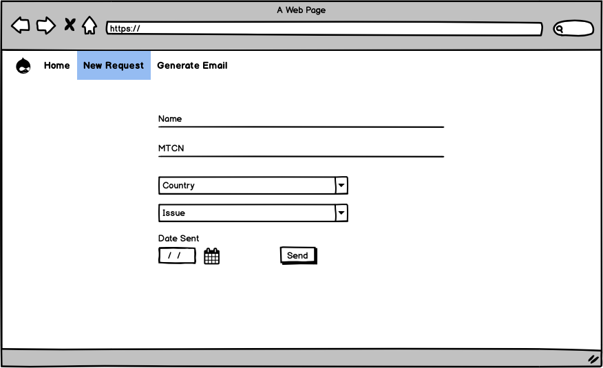
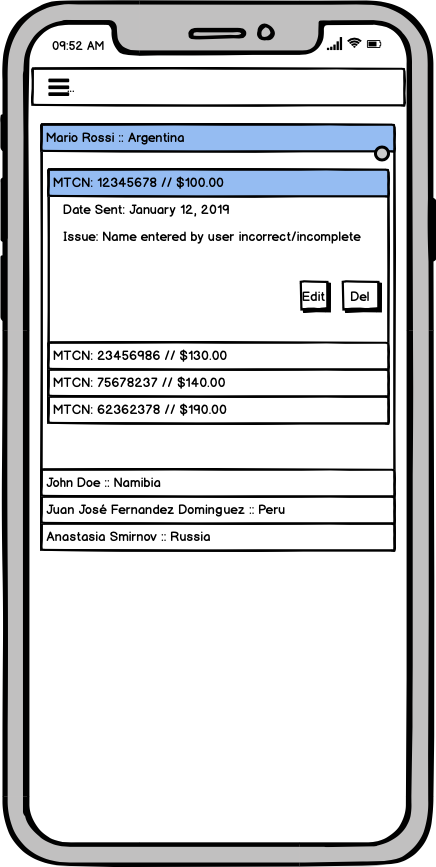

# Western Onion App

Milestone Project - Data Centric Development - Code Institute

**FOR EDUCATIONAL PURPOSE ONLY**

The customer is the Customer Support department of an online gaming company. Company's users can make money partipating on online gaming competitions. Those gains are added to their virtual wallets and, at the user's request, sent to the user via Western Union.

For different reasons a user may find difficulties cashing out the money sent via Western Union and needs to contact the company's Customer Support department for assistance. Front line agents handle communication with the end user and collect all details of the payout that was sent via Western Union. Then they fill in an spreadsheet with the payout details. Once per day a Manager collects all the payouts information in the spreadsheet and composes an email that then sends to Western Union for processing.

The Customer Support department request is to create a web based app to handle the collection and management of the information by the customer support agents and automates the generation of the email to Western Union.

The app will be named WesternOnion in reference to the payments provider.
 
## UX
### User Stories

- As agent, I want to be able to add multiple payouts to a single customer, so I don't need to input repeated information
    - **Feature:** Add button next to each customer record

- As agent, I want to be able to remove payouts added, so we don't waste resources if action is no needed anymore
    - **Feature:** Delete button next to each payout. If last payout removed it also removes the record of the customer

- As agent, I want to be able to edit payouts added, so we don't need to delete and add again all information if a mistake is made
    - **Feature:** Edit button next to each payout.

- As manager, I want to be able to easily generate the email to WU, so I don't need to waste time by doing lots of copy and paste.
    - **Feature:** "Generate email" button

- As manager, I want everyone to know the information has been sent to WU, so we are all in the loop
    - **Feature:** Once the WU email has been generated all records are deleted

### Wireframes
For the skeleton element of the UX design of this project, the [balsamiq.cloud](https://balsamiq.cloud) tool was used to create the wireframes.

  

## Data Model


## Features
The site is responsive and mobile first, even if due to the simplicity achieved on the User Interface there's little difference between different screen sizes.

A collapsible navbar has been implemented which collapses on screens smaller than medium.

EmailJS is used to email the report regenerated by the app, and the email address is set by the user via a modal that is displayed on an overlay.

### Features Left to Implement
#### Generate report should only be accessible to IT managers.
This could be achieved by implementing OAuth 2.0 authentication or some other type of user authentication. An alternative solution could be passing a token or requesting a passcode in order to proceed with the report generation and emailing.

#### Failed validation for 'country' and 'reason to cancel' dropdown
Bug.

## Technologies Used

1. HTML
2. CSS
3. JavaScript
3. Materialize (v1.0.0) https://materializecss.com
4. Python (v.3.8.0)

## Testing

The site has been tested in multiple browsers (Chrome & Safari) in MacOS and Android 10 phone to ensure compatibility and responsiveness.

The following manual tests have been carried out:
- Make mongoDB inaccesible and attempt all webapp functionalities that require a mongoDB call
- Take the network down and attempt to send a report by email
- Submit form without all the fields filled
- Add new beneficiary and payout
- Delete payout and delete last payout (which causes as well deletion of beneficiary)
- Edit payout and beneficiary information
- Try all combinations of request type + category in the dropdown menus

All user stories have been checked to confirm the website offers a solution to them.

## Deployment

This site is hosted using GitHub pages, deployed directly from the master branch. The deployed site will update automatically upon new commits to the master branch. In order for the site to deploy correctly on GitHub pages, the landing page must be named index.html

In order for the app to be functional you need to have an Asana account (free) and setup your **Asana Personal Access Token** and **Target Asana project ID** in the app.

### Deployment steps:
#On Heroku
1. click `New` > `Create new app`
2. Enter a name for your app on Heroku, select region and click `Create app`
#On Terminal
3. Create `requirements.txt` file by typing in your terminal in the project root directory:
```
pip3 freeze --local > requirements.txt
````
4. Create a file `Procfile` with content:
```
web: python app.py
```
5. type `heroku login` and follow the instructions to log into Heroku
6. Add to Git your heroku app remote:
````
heroku git:remote -a [enter_your_heroku_app_name_from_step_2]
```
7. Stage `Procfile`and `requirements.txt` and then commit
8. Push to Heroku:
```
git push heroku master
```


1. In the GitHub repository page, click **Settings**
2. Scroll down to the section **GitHub Pages**
3. Select from the dropdown the branch to publish. Usually **master branch**
4. At the top of the **GitHub Pages** section you will find the URL of the deployed site

### Setting up database
In order to create the collections needed to populate the "country" and "reason to cancel" dropdown, a python script is provided and can be run typing the following in a terminal:
```
python3 setup_DB.py
```

### To run locally
You can clone this repository by typing `git clone https://github.com/jordy-silva/ci-western_onion-msp.git` into your terminal, given that git is installed in your machine. You will need a python installed in your machine.


## Credits

### Content
- Text from the *Deployment* section of this document has been copied and adapted from Code Institute's [example project](https://github.com/Code-Institute-Solutions/StudentExampleProjectGradeFive/blob/master/README.md)

### Acknowledgements
- StackOverflow was consulted for help with different challenges during the project.
- Materialize documentation and examples have been used as base for some parts of the website.
- How to use flash messages was consulted here: https://flask.palletsprojects.com/en/1.1.x/patterns/flashing/
- List of countries for script to create the mongoDB collection script was obtained here: https://stackoverflow.com/questions/13678901/word-cities-towns-countries-database-for-mongodb-or-in-json
